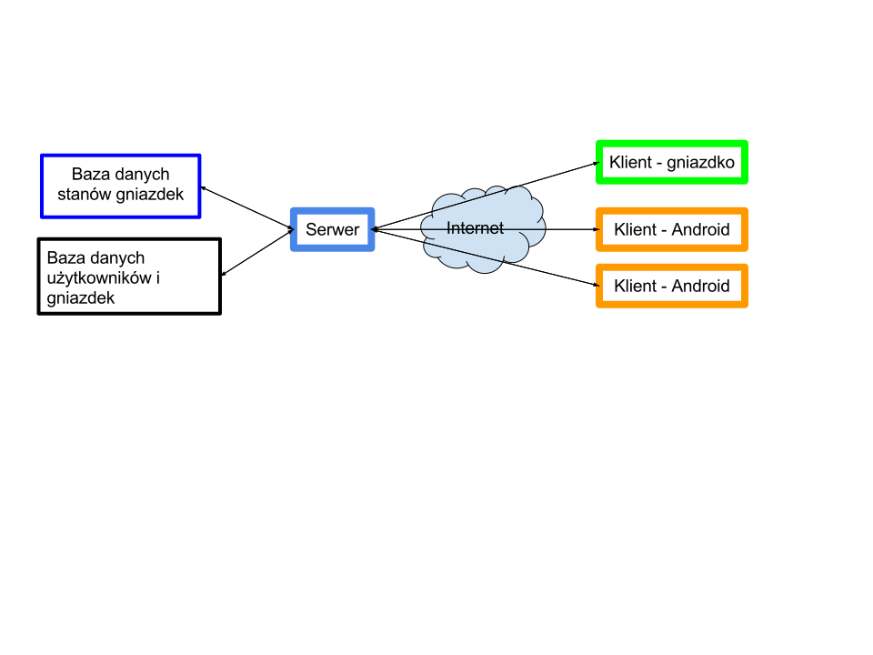

Architektura
**************

Wówczas będziemy mieli 1 **serwer/klaster**, który steruje gniazdkami, a także **dwa rodzaje klientów**:

* odpowiedzialnych za sterowanie gniazdkami,
* gniazdka.

W przypadku każdej sieciowej aplikacji sieciowej musimy stworzyć **protokół** tzn. **język komunikacji komponentów**, który będzie zrozumiały dla serwera i dla każdego rodzaju klientów. Wydaje mi się, że forma działania takiego protokołu musi wynikać z specyfiki dostępu do Internetu z poziomu mikrokontrolera, aby nie pożerało to ogromnej ilości prądu podczas ciągłego działania. Dzięki ustalonemu protokołowi możemy budować równolegle i niezależnie od siebie komponenty, a potem je spiąć z sobą.

Będziemy potrzebowali także przechowywać informacje o użytkownikach (login, hasło), a dla nich informacje o urządzeniach (identyfikator, stan). Dane te - ze względu na swój charakter - nie mogą być przechowywane w pamięci operacyjnej aplikacji, bo wystarczy awaria serwera, aby coś się utraciło.

